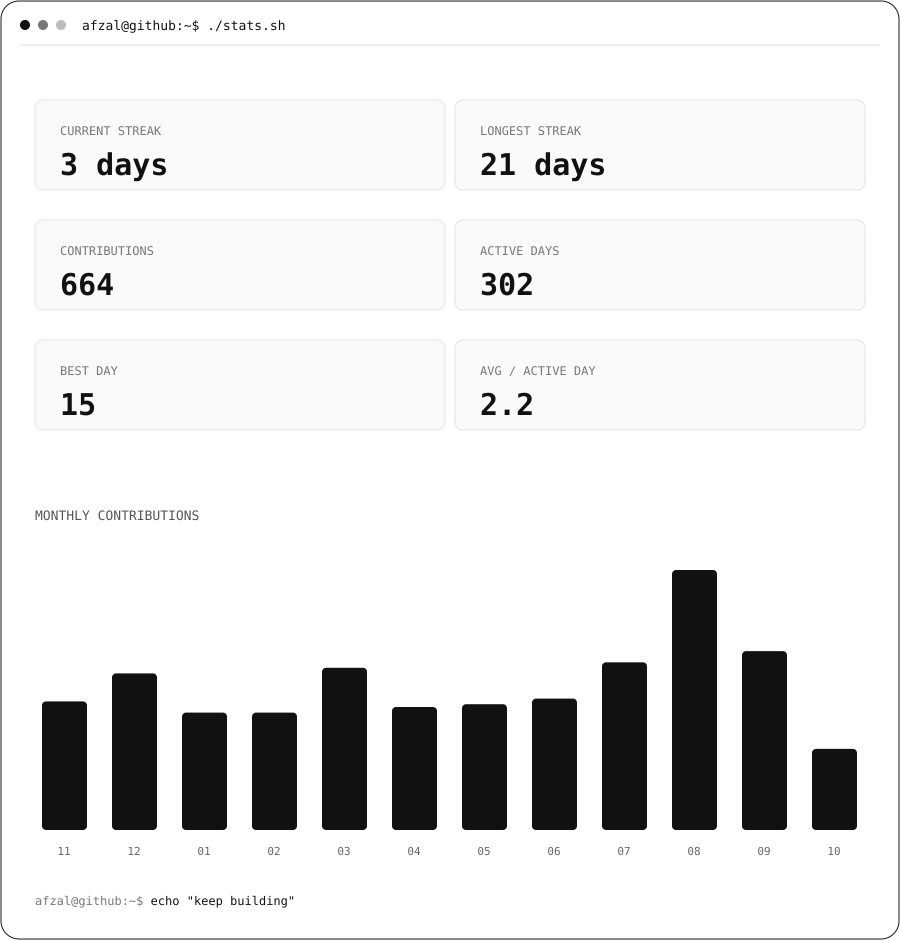

<!-- animated contribution graph: real data, boxes reveal cell by cell
     (regenerated daily by .github/workflows/update-profile-art.yml) -->

<h3><code>afzal@github ~ $ ./contributions.sh</code></h3>

 
 

<!-- portrait (left) + streak/numbers card (right), matching the reference layout -->

<h3><code>afzal@github ~ $ whoami</code></h3>

&nbsp;

 
 

<h3><code>afzal@github ~ $ ./links.sh</code></h3>

<b>Fullstack Developer · AI Builder · Instructor</b>

 

